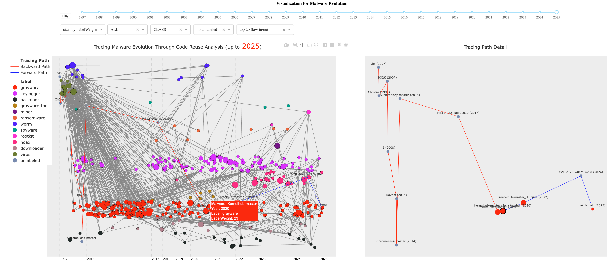

# MASCOT

MASCOT (Malware Source Code Open Treasury) is the companion repository for the paper [*MASCOT: Analyzing Malware Evolution Through A Well-Curated Source Code Dataset*](./MASCOT__Malware_Evolution_Through_A_Well_curated_Source_Code_Dataset%20%282%29.pdf).

This repository does not ship live malware or executables. It provides curated metadata tables, parsed labels, visualization assets, screenshots, and demo recordings used to study malware evolution through source code reuse.



> Research-use notice
>
> The project is intended for academic and defensive security research only. The repository snapshot is disarmed and does not include malicious executables.

## At a Glance

| Item | Summary |
| --- | --- |
| Core contribution | A manually reviewed malware source code dataset and an interactive genealogy visualization workflow |
| MASCOT scale | 6032 specimens collected from GitHub |
| Time span | Up to February 2025 |
| Labels | FUD, family, behavior, vulnerability, class, file, pack, and unknown |
| Main artifact types here | Excel metadata, parsed labels, CSV statistics, Jupyter/Dash visualization notebook, screenshots, recordings |
| External dataset release | [IEEE DataPort](https://ieee-dataport.org/documents/mascot), [Hugging Face](https://huggingface.co/datasets/Bojing94/MASCOT) |

## What This Repository Contains

This repo is best understood as the paper artifact, not the full raw malware-code archive.

Included here:

- Curated spreadsheet metadata for MASCOT and the MalSource comparison set.
- Parsed malware labels for major languages.
- Precomputed CSV files used by the visualization notebook.
- Demo screenshots and recordings of the genealogy interface.


## Data Files

### `MASCOT.xlsx`

This workbook contains three sheets:

| Sheet | Purpose |
| --- | --- |
| `MASCOT` | Main specimen metadata: GitHub project name, source folder name, date, language, URL, keyword, and notes |
| `keywords` | Collection keywords used during dataset construction |
| `MalSource` | The 456-sample comparison dataset used for the long-range historical analysis |

The `MASCOT` sheet currently contains 6032 rows. The most common languages in this snapshot are Python, C++, C, C#, Assembly, Go, HTML, PowerShell, PHP, and Rust.

Note: the paper reports 32 languages, while the raw spreadsheet preserves some alias and casing variants such as `.NET`/`.Net` and `HTML`/`html`.

### `MASCOT_LABELS.xlsx`

This workbook stores parsed labels for the major languages emphasized in the paper:

| Sheet | Rows | Notes |
| --- | ---: | --- |
| `MASCOT_C&Cpp` | 1160 | C/C++ specimens with parsed label fields |
| `MASCOT_Assembly` | 240 | Assembly specimens |
| `MASCOT_CSharp` | 449 | C# specimens |
| `MASCOT_Python` | 1765 | Python specimens |
| `MalSource_C&Cpp` | 456 | Historical comparison subset |

Each sheet includes the original source-folder name, parsed ClarAVy and AVClass2 outputs, and label columns such as `FILE`, `UNK`, `FAM`, `VULN`, `BEH`, `CLASS`, and `PACK`.

### `MASCOT_VIS/data`

The visualization currently ships with these key inputs:

| File | Purpose |
| --- | --- |
| `MASCOT.xlsx` | Local copy of the metadata workbook for notebook use |
| `overall_tree_vis_Deckard_final.csv` | Specimen-level code-reuse graph used for the overall genealogy |
| `func_tag_result.csv` | Parsed function tags used to describe reused functionality |
| `types_year.csv` | MalSource historical type/year data |

`overall_tree_vis_Deckard_final.csv` contains 277,656 project-level reuse edges, and `func_tag_result.csv` contains 115,090 function-tag rows.

## External Resources

- Paper PDF: [IEEE](https://ieeexplore.ieee.org/abstract/document/11401016)
- Dataset release: [IEEE DataPort](https://ieee-dataport.org/documents/mascot)
- Dataset mirror: [Hugging Face](https://huggingface.co/datasets/Bojing94/MASCOT)

## Citation

If you use this artifact, please cite the paper. A safe placeholder entry is:

```bibtex
@INPROCEEDINGS{11401016,
  author={Li, Bojing and Zhong, Duo and Nadendla, Dharani and Terceros, Gabriel and Bhandary, Prajna and S, Raguvir and Nicholas, Charles},
  booktitle={2025 IEEE International Conference on Big Data (BigData)}, 
  title={MASCOT: Analyzing Malware Evolution Through a Well-Curated Source Code Dataset}, 
  year={2025},
  volume={},
  number={},
  pages={7814-7824},
  keywords={Codes;Costs;Source coding;Standardization;Manuals;Market research;Malware;Security;History;Software engineering},
  doi={10.1109/BigData66926.2025.11401016}}
```
